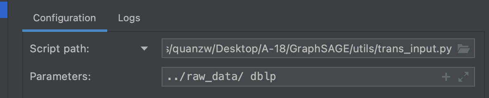
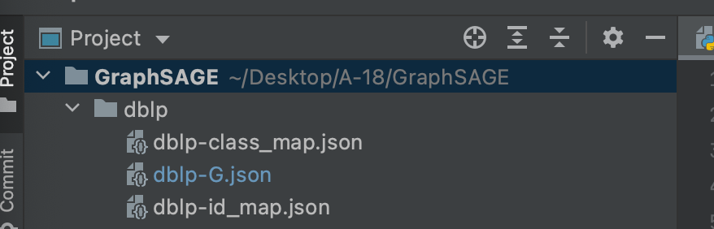
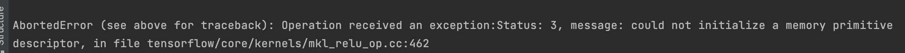
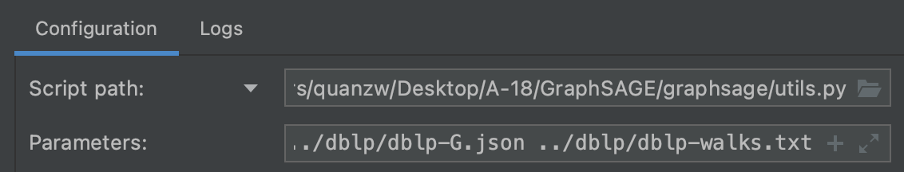
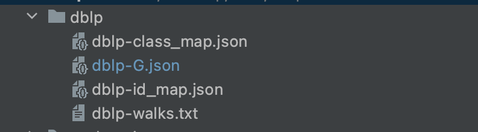
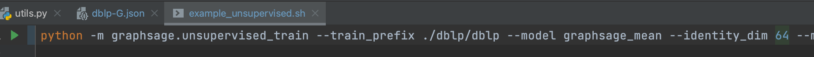
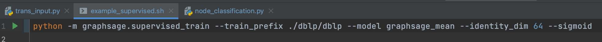
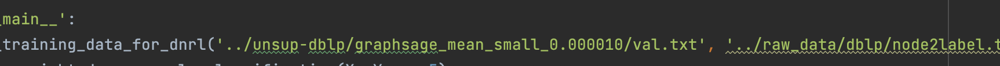
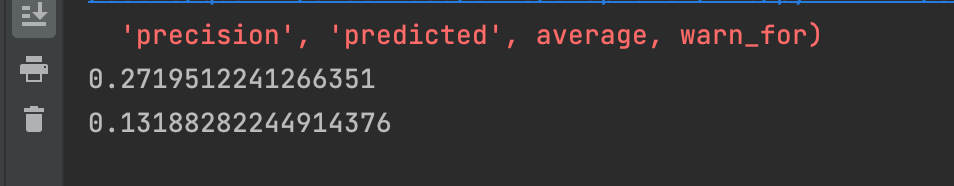
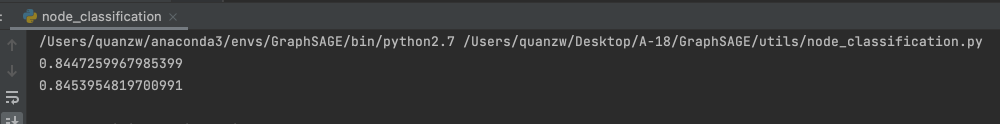

# 1. 项目地址
https://github.com/quanzw99/GraphSAGE

# 2. 任务拆分
| 细化任务  | 是否完成  |
| ----  |----  |
| 实现输入转化的工具 |是  |
| 调整无监督学习输出，适用于节点分类 |是  |
| 实现监督学习输出 |是  |
| 调整监督学习输出，适用于节点分类 |是  |

# 3. 踩坑总结
## 3.1 系统找不到conda
```zsh: command not find:conda```

本地环境之前能正常使用conda，现在提示找不到命令。
解决方案：[参考](https://www.jianshu.com/p/13f5d20e61f8)；在~/.zshrc加入配置即可；之前有配置过不生效的原因不清楚。

## 3.2 设置conda环境指针

File -> New Projects Settings -> Preferences for New Projects

在Python Interpreter上选择在conda配置好的环境指针。（注：此项目用的py2.7 下载conda时一定要下载2.7的稳定版。若使用py3的版本，配置三方库时会出现一些找不到低版本的问题）

## 3.3 设置启动脚本
按照原git项目启动脚本配置启动设置，需注意更改train_prefix参数。原项目中参数和实际的数据名对不上，要么在官网下载处理好的数据，要么把train_prefix改成./example_data/toy-ppi

## 3.4 数据集分析

1. 原项目README.md中说明<train_prefix>-feats.npy与<train_prefix>-walks.txt两个文件为optional，我们现有的数据中也无相关文件，故忽略。
2. <train_prefix>-walks.txt虽然optional，但在训练前需使用工具graphsage/utils.py根据-G文件提供的图产生walks文件。
3. 实际上<train_prefix>-class_map.json也与训练过程无关，在原项目的下游实验中eval_scripts/ppi_eval.py中处理。虽然在我们的node_classfication.py里用不到，但是输入转化工具实现了此文件的转化，需要用原项目的下游实验时可以使用（注意输出改回原项目的实现）。
4. 原项目中自带的toy-ppi数据较混乱，猜测是用于演示目的，所以G.json文件中包含大量feats和label数据，从项目官网下载到的Protein-Protein Interactions数据集清爽很多，所以输入转化工具按照官网PPI的数据实现。
5. 输入转化工具实现细节见utils/trans_input.py的注释。
6. 对于没有feats文件的数据集，必须在启动批处理example_unsupervised.sh中定义identity_dim参数。
7. 无监督学习版本，-G文件不能不包含"test": true的node；监督学习版本，-G文件不能不包含"val": true的node（即必须包含）；具体原因应和底层实现逻辑相关; 

# 4. 实验流程
## 4.1 输入预处理
输入预处理将MNCI-C提供的数据输入格式 转换为 GraphSAGE项目可以读入的输入格式。



第一个参数为原始数据存放的文件目录，第二个参数为数据在这个文件夹下的文件名称。


会自动读取第二个参数同名的txt文件和node2label.txt。
运行后完成后，将在项目根目录下得到与第二个参数的同名的文件夹，产生非optional的三个文件。



-G文件需要包含test或val节点；否则将在下一步报以下错误或提示val节点不能为空;


这里随机10%的节点为"test": true；随机另外10%的节点为"val": true；剩余其他节点均为train节点。

## 4.2 生成walks文件
通过-G文件中提供的图信息；生成walks文件。

第一个参数为-G文件路径，第二参数为期望产生的walks文件路径。

图1配置的运行结果如图所示。

## 4.3 训练过程
启动脚本train_prefix是训练数据的前缀，训练读取数据是会自动寻找<train_prefix>-G.txt等文件。没有<train_prefix>-feats.npy文件必须定义--identity-dim参数。

### 4.3.1 无监督学习

运行结束后在原项目的根目录下的unsup-<数据集名称>的文件夹有输出的表征结果。

### 4.3.2 监督学习

运行结束后在原项目的根目录下的sup-<数据集名称>的文件夹有输出的表征结果。

## 4.4 下游任务
utils/node_classification.py与之前的使用方式一致，第一个参数为输出文件路径，第二个参数为对应的node2label.txt路径。

原项目中的参数，除了启动脚本中max_total_steps改小了方便调试，其余参数未修改。

### 4.4.1 无监督学习
dblp数据集实验结果如下：


### 4.4.2 监督学习
dblp数据集实验结果如下：
